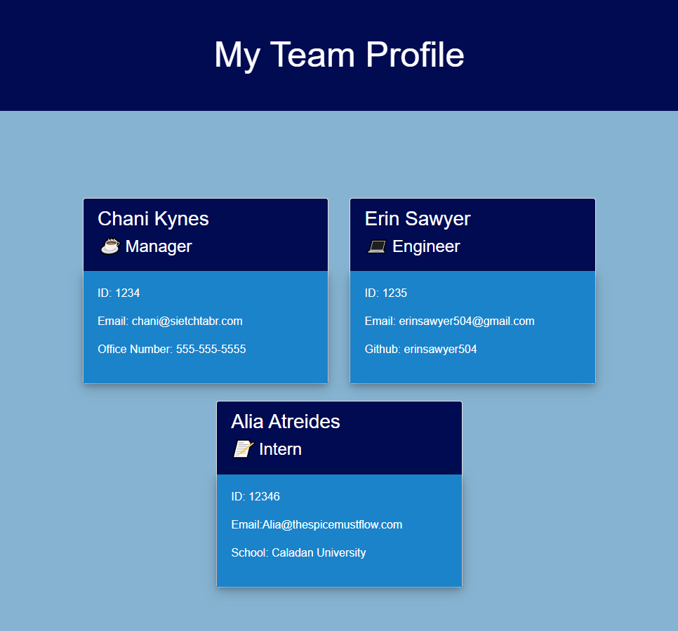

# Team Profile Generator

## Description
This project takes a user's input on their team and turns it into a profile of their team.  It asks for the Manager's name along with their id#, email address, and office phone number.  The application then asks if you would like to add an Engineer or an Intern to your team.  If Engineer is selected, then it will ask you for their name, work id#, email address, and github user name.  Likewise, if Intern is selected, it will also ask for their name, work id#, email address and the school that they attend.  The application will allow you to add as many team members as you would like. When finished, press 'N' to stop the application from running and the HTML will be generated automatically to show you your entire team. 

## Links
- [Sample HTML](https://github.com/erinsawyer504/team-profile-generator/blob/main/dist/index.html)
- [github repo](https://github.com/erinsawyer504/team-profile-generator)
- [Video Demo](https://drive.google.com/file/d/1x1DT4_B1b5bDiA63j8ZvsHd7A71DtHyn/view)

## Table of Contents
- [Installation](#installation)  
- [Usage](#usage)  
- [License](#license)  
- [Constributing](#contributing)  
- [Tests](#tests)  
- [Questions](#questions)

## Installation
Clone the repo into your vs code, install inquirer if needed by typing "npm i inquirer@8.2.4" in the terminal and run it by typing "node index.js"-

## Usage
Here is a screenshot that shows how the app runs

## License
This repository is not covered under any license.

## Contributing
To contribute to this application, just fork the repository!

## Tests
This application uses jest to test the application's code.  To run a test, type "npm run test" in the terminal and press enter.  This application will pass all tests ran. 

## Questions
GitHub username: erinsawyer504, 
GitHub profile: (https://www.github.com/erinsawyer504)    
Email address: erinsawyer504@gmail.com  
If you have additional questions, please feel free to email me.
